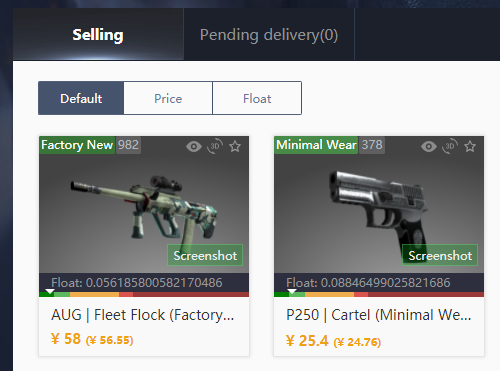
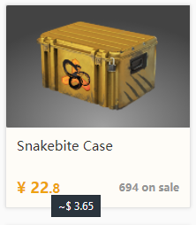

#### Buff Utility

---

Have you ever looked at your selling page and wondered, how much am I getting for this?
Yes me neither, yet I still made this.

 

###### Main Features

---

* Selling page now displays what you get after fees!

You can find what you receive in brackets behind the listed sale price.

---

* Currency conversion

Ever wondered what the listing is in a different currency? 
Me neither, yet I still added it because it is interesting to have.

 

To see the converted price, just hover over any price tag.
Remember the prices are **an estimation** at current conversion rate.

 

Examples:

 

To change currency, check next to the language selection,
you are now provided with a dropdown for supported currencies.

If you wish your currency was added to this, please open a GitHub Issue.

 

List of currently supported currencies:
* USD
* EUR
